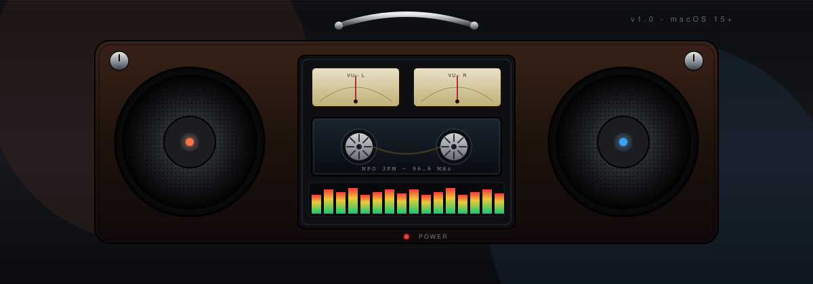
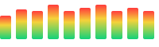

<div align="center">



<br/>

<a href="https://readme-typing-svg.demolab.com">
  
</a>

<br/>
<br/>

<a href="https://github.com/nandichi/Radio-Naoufal/releases/latest"></a>
<a href="https://github.com/nandichi/Radio-Naoufal/releases"></a>


<br/>
<br/>

### Download

<a href="https://github.com/nandichi/Radio-Naoufal/releases/latest"></a>
&nbsp;
<a href="https://github.com/nandichi/Radio-Naoufal/releases"></a>
&nbsp;
<a href="#bouwen-vanaf-source"></a>

<br/>
<br/>


</div>

> **Radio Naoufal** is een native macOS radio-app waarvan het hart een skeuomorfische **1980s boombox** is, getekend in SwiftUI: twee speakers, analoge VU-meters, een cassette-deck als Now Playing display, een FM tuner-dial en chrome draaiknoppen. Eronder een uitklapbare drawer met favorieten, recent geluisterd, categorieen en zoeken in Radio-Browser. Audio loopt via `AVPlayer` met `MTAudioProcessingTap` zodat de VU-meters en EQ-bars **echt** reageren op het signaal. AirPlay zit ingebouwd, Chromecast via ChromecastKit, en alles wordt gespiegeld naar de macOS Now Playing widget en media keys.

<br/>

## Inhoud

- [Snel downloaden](#snel-downloaden)
- [Highlights](#highlights)
- [Zenders](#zenders)
- [Installatie](#installatie)
- [Bouwen vanaf source](#bouwen-vanaf-source)
- [Repo structuur](#repo-structuur)
- [Architectuur](#architectuur)
- [Keyboard shortcuts](#keyboard-shortcuts)
- [Roadmap](#roadmap)
- [Bekende limitaties](#bekende-limitaties)
- [Contributing](#contributing)
- [Credits](#credits)
- [License](#license)
- [English summary](#english-summary)

<br/>


## Snel downloaden

| Manier | Beschrijving | Link |
| --- | --- | --- |
| **DMG installer** | Klaar-voor-gebruik `.dmg` met `Radio Naoufal.app` erin | [Latest release](https://github.com/nandichi/Radio-Naoufal/releases/latest) |
| **GitHub Releases** | Alle versies + release notes | [Releases](https://github.com/nandichi/Radio-Naoufal/releases) |
| **Bouw zelf** | Clone de repo en run `./Scripts/build-app.sh` | [Bouwen vanaf source](#-bouwen-vanaf-source) |
| **Git clone** | `git clone https://github.com/nandichi/Radio-Naoufal.git` | [Clone](https://github.com/nandichi/Radio-Naoufal) |

> **Eerste keer openen op macOS 15 (Sequoia) of macOS 26 (Tahoe)?** Omdat de app niet Apple-notarized is, blokkeert Gatekeeper hem standaard. Open Terminal en voer dit uit (1 commando, klaar):
>
> ```bash
> xattr -dr com.apple.quarantine "/Applications/Radio Naoufal.app"
> ```
>
> Daarna start de app gewoon met dubbelklikken. Werkt niet? Zie de uitgebreide [installatie-uitleg](#installatie). De DMG bevat ook een `EERSTE GEBRUIK.txt` met dezelfde instructies.

<br/>

## Highlights

<table>
<tr>
<td valign="top" width="50%">

<picture></picture>

#### Boombox UI

- Twee speakers met pulserende dust-caps
- Analoge **VU-meters** met live wijzer-bewegingen
- **Cassette-deck** als Now Playing display met draaiende reels en bewegende tape-band
- **FM tuner-dial** met handmatige slide
- Chrome **draaiknoppen** voor volume + balans
- Power-LED die ademt

</td>
<td valign="top" width="50%">

#### Audio engine

- `AVPlayer` voor streaming (MP3, AAC, HE-AAC)
- `MTAudioProcessingTap` voor live audio buffers
- `vDSP` FFT met 16 logaritmisch verdeelde EQ-bars
- Per-kanaal **RMS** voor de VU-meters
- **ICY metadata** parser (Shoutcast/Icecast)
- Soft fade-in/out, sleep timer met fade

</td>
</tr>
<tr>
<td valign="top">

#### Stations

- **35+ curated** Nederlandse zenders (NPO 1-5, FunX, Sky, 538, Qmusic, Radio 10, Veronica, 100% NL, SLAM!, BNR, Sublime, KINK, JOE, Arrow, RadioNL, alle regionale omroepen)
- **Radio-Browser** integratie - duizenden extra zenders wereldwijd
- 9 **presets** met `cmd+1..9` shortcuts
- Favorieten + recent geluisterd
- Live zoeken

</td>
<td valign="top">

#### Casting & integratie

- Native **AirPlay** via `AVRoutePickerView`
- **Chromecast** via ChromecastKit + Bonjour fallback
- **Now Playing widget** in macOS Control Center
- **Media keys** (fn-toetsen) support
- **MenuBar mini-player** met play/pause + volume
- Nederlands + Engels localized

</td>
</tr>
</table>

<br/>


## Zenders

<details>
<summary><b>Klap uit voor alle 34 curated zenders</b></summary>

<br/>

| # | Zender | Genre | Regio |
| --- | --- | --- | --- |
| 1  | NPO Radio 1               | Nieuws / sport / talk  | Landelijk |
| 2  | NPO Radio 2               | Pop classics           | Landelijk |
| 3  | NPO 3FM                   | Alternative / rock     | Landelijk |
| 4  | NPO Radio 4               | Klassiek               | Landelijk |
| 5  | NPO Radio 5               | Oldies (60s/70s)       | Landelijk |
| 6  | FunX                      | Urban / hiphop         | Landelijk |
| 7  | NPO Radio 6 Soul & Jazz   | Soul / jazz            | Landelijk |
| 8  | Sky Radio                 | Hits / pop             | Landelijk |
| 9  | Radio 538                 | Hits / dance           | Landelijk |
| 10 | Qmusic                    | Hits / pop             | Landelijk |
| 11 | Radio 10                  | Classics               | Landelijk |
| 12 | Radio Veronica            | Rock / classics        | Landelijk |
| 13 | 100% NL                   | Nederlandstalig        | Landelijk |
| 14 | SLAM!                     | Dance / EDM            | Landelijk |
| 15 | BNR Nieuwsradio           | Business / nieuws      | Landelijk |
| 16 | Sublime                   | Jazz / soul            | Landelijk |
| 17 | KINK                      | Alternative / rock     | Landelijk |
| 18 | JOE                       | Classics               | Landelijk |
| 19 | Arrow Classic Rock        | Classic rock           | Landelijk |
| 20 | RADIONL                   | Nederlandstalig / volk | Landelijk |
| 21 | Radio Decibel             | Dance / hits           | Landelijk |
| 22 | Radio Noordzee            | Pop / hits             | Landelijk |
| 23 | RTV Noord Holland         | Regionaal              | Noord-Holland |
| 24 | Omroep Brabant            | Regionaal              | Noord-Brabant |
| 25 | Radio Rijnmond            | Regionaal              | Rotterdam |
| 26 | Omroep West               | Regionaal              | Den Haag |
| 27 | Radio M Utrecht           | Regionaal              | Utrecht |
| 28 | Radio Gelderland          | Regionaal              | Gelderland |
| 29 | Radio Oost                | Regionaal              | Overijssel |
| 30 | RTV Drenthe               | Regionaal              | Drenthe |
| 31 | RTV Noord                 | Regionaal              | Groningen |
| 32 | Omrop Fryslan Radio       | Regionaal              | Friesland |
| 33 | L1 Radio                  | Regionaal              | Limburg |
| 34 | Omroep Zeeland Radio      | Regionaal              | Zeeland |

</details>

<br/>

Plus duizenden internationale zenders via **[Radio-Browser](https://www.radio-browser.info)** integratie.

<br/>


## Installatie

### Optie A - Download de DMG (aanbevolen)

1. Ga naar **[Releases](https://github.com/nandichi/Radio-Naoufal/releases/latest)**.
2. Download `RadioNaoufal-x.y.z.dmg`.
3. Dubbelklik de `.dmg`, sleep `Radio Naoufal.app` naar `/Applications`.
4. **Eerste keer (verplicht op macOS 15 Sequoia en macOS 26 Tahoe)**: open Terminal en voer uit:

   ```bash
   xattr -dr com.apple.quarantine "/Applications/Radio Naoufal.app"
   ```

   Dat verwijdert de `com.apple.quarantine`-vlag die macOS automatisch toevoegt bij gedownloade bestanden. Zonder deze stap wordt een app zonder Apple Developer ID op nieuwere macOS-versies direct gekild door de kernel (er verschijnt geen foutmelding, hij start kort en sluit weer).
5. Klaar. Druk `Space` om af te spelen.

> **Waarom moet dit?** De DMG bevat een ad-hoc gesignde app met hardened runtime, maar zonder Developer ID-certificaat (kost 99 USD/jaar bij Apple). Op macOS Sequoia/Tahoe weigert Gatekeeper standaard zo'n app. Het `xattr`-commando vertelt macOS expliciet dat jij deze app vertrouwt. Het is precies hetzelfde wat de "rechts-klik > Open"-truc deed in oudere macOS-versies - alleen die werkt niet meer betrouwbaar in Tahoe.

### Optie B - Homebrew (binnenkort)

```bash
brew install --cask nandichi/tap/radio-naoufal
```

> Cask tap is in voorbereiding - zie [Roadmap](#roadmap).

### Optie C - Bouw vanaf source

Zie de volledige instructies hieronder.

<br/>


## Bouwen vanaf source

### Vereisten

- **macOS 15.0+** (Sequoia of nieuwer)
- **Xcode 16.0+** voor een redistributable `.app` (volledige Xcode, niet alleen Command Line Tools)
- **Swift 6.0+**
- **xcodegen** (optioneel): `brew install xcodegen`

> Het project bouwt ook met enkel Command Line Tools via `swift build`, maar voor een volledige `.app` bundle is Xcode nodig.

### Project openen in Xcode

<details>
<summary><b>Optie 1 - via XcodeGen (aanbevolen)</b></summary>

```bash
brew install xcodegen
xcodegen generate
open RadioNaoufal.xcodeproj
```

</details>

<details>
<summary><b>Optie 2 - via Swift Package Manager</b></summary>

```bash
open Package.swift
```

Xcode opent een workspace op basis van de SPM-configuratie.

</details>

### Bouwen vanaf de command line

<details>
<summary><b>Snelle compile-check (alleen Command Line Tools)</b></summary>

```bash
swift build
```

</details>

<details>
<summary><b>Volledige .app + .dmg</b></summary>

```bash
./Scripts/build-app.sh Release
./Scripts/make-dmg.sh
```

De `.dmg` belandt in `dist/RadioNaoufal-1.0.0.dmg`.

</details>

### Code signing & notarization

`build-app.sh` doet automatisch **ad-hoc code signing** met hardened runtime + entitlements. Dat is voldoende om de app te laten draaien op macOS 15 (Sequoia) en macOS 26 (Tahoe). Het is **niet** een Apple Developer ID-signature, dus Gatekeeper toont nog steeds een blokkade bij eerste opening - los je op met de `xattr`-stap uit [Installatie](#installatie).

Drie scenario's:

1. **Lokaal bouwen + draaien op je eigen Mac**: gewoon `./Scripts/build-app.sh Release`. Geen extra stappen nodig - de build verwijdert direct het quarantine-attribuut.
2. **Distribueren via GitHub Releases (zonder Developer ID)**: `./Scripts/make-dmg.sh`. Gebruikers moeten zelf de `xattr`-stap doen. De DMG bevat hiervoor een `EERSTE GEBRUIK.txt`.
3. **Distribueren met Apple Developer ID-notarization** (vereist Apple Developer-account, 99 USD/jaar):

   ```bash
   codesign --deep --force --options runtime \
     --entitlements RadioNaoufal/RadioNaoufal.entitlements \
     --sign "Developer ID Application: Jouw Naam (TEAMID)" \
     "build/Radio Naoufal.app"

   xcrun notarytool submit dist/RadioNaoufal-1.0.0.dmg \
     --apple-id "you@example.com" \
     --team-id TEAMID \
     --password "@keychain:notary-password" \
     --wait

   xcrun stapler staple dist/RadioNaoufal-1.0.0.dmg
   ```

> **Belangrijk**: hardened runtime + geen enkele signature is een **fatale combinatie op macOS Tahoe** - de kernel weigert de binary uberhaupt te laden. Daarom doet `build-app.sh` altijd ad-hoc signing, ook als je geen Developer ID hebt. Zie de `--options runtime` flag in het script.

<br/>


## Repo structuur

```
Radio-Naoufal/
  project.yml                    # XcodeGen config voor .xcodeproj generatie
  Package.swift                  # SPM fallback voor CLI builds
  RadioNaoufal/                  # alle Swift source files
    App/                         # @main App + ContentView
    Domain/                      # Models + ViewModels
    Services/                    # Audio, Stations, Casting, NowPlaying, Persistence
    Features/                    # SwiftUI views per feature
      Boombox/                   # de boombox-hero
      BrowseDrawer/              # uitklapbare drawer met 4 tabs
      Menubar/                   # MenuBarExtra mini-player
      Casting/                   # Chromecast device picker
      SleepTimer/                # popover
    Resources/
      Assets.xcassets/           # app icon + accent color
      curated-stations.json      # de 34 zenders
      Localizable.xcstrings      # nl + en strings
    Info.plist
    RadioNaoufal.entitlements
  RadioNaoufalTests/
  Scripts/
    generate-app-icon.swift      # genereert de boombox-icoon
    build-app.sh                 # bouwt .app via xcodebuild
    make-dmg.sh                  # bouwt .dmg installer
  docs/                          # README assets (SVG, screenshots)
  .github/workflows/release.yml  # automatische DMG bouwen bij tag
```

<br/>

## Architectuur

| Component | Verantwoordelijkheid |
| --- | --- |
| **`AudioEngine`** | Wrapper rond `AVPlayer` + `MTAudioProcessingTap`. Play/pause/stop, volume, fade-out. Publiceert `PlayerState` via `@Observable`. |
| **`AudioTap`** | Swift-wrapper rond `MTAudioProcessingTap` die per audio-frame RMS-waarden en sample-arrays levert. |
| **`VisualizerEngine`** | Verwerkt frames met `vDSP_FFT` tot VU-niveau (per kanaal) en 16 logaritmisch gesplitste EQ-bars. |
| **`ICYMetadataParser`** | Parallelle URLSession bytestream met `Icy-MetaData: 1` header, parsed inline ICY metadata uit Shoutcast/Icecast streams. |
| **`StationsRepository`** | Laadt curated stations uit `Resources/curated-stations.json` + haalt extra zenders op uit `https://api.radio-browser.info`. |
| **`CastManager`** | Beheert Chromecast device discovery + cast-sessies via ChromecastKit. Fallt terug op Bonjour-only discovery wanneer ChromecastKit faalt. |
| **`NowPlayingCenter`** | Integreert met `MPNowPlayingInfoCenter` + `MPRemoteCommandCenter` voor de macOS Now Playing widget en media keys. |
| **`DataStore`** | Eenvoudige JSON-gebaseerde persistence in `~/Library/Application Support/RadioNaoufal/` voor favorieten + recent. |

<br/>

## Keyboard shortcuts

| Shortcut          | Actie                          |
| ----------------- | ------------------------------ |
| `Space`           | Afspelen / pauzeren            |
| `Cmd+1` ... `9`   | Speel preset 1-9               |
| `Cmd+Right`       | Volgende zender                |
| `Cmd+Left`        | Vorige zender                  |
| `Cmd+F`           | Open zoek-sheet                |
| `Cmd+T`           | Sleep timer                    |
| `Cmd+Q`           | Stop Radio Naoufal             |
| Media keys        | Play/pause via fn-toetsen      |

<br/>


## Roadmap

- [ ] Homebrew Cask tap (`brew install --cask radio-naoufal`)
- [ ] Code signing + Apple notarization in de release workflow
- [ ] DAB+ via USB-tuner ondersteuning (optioneel hardware-pad)
- [ ] Opnemen van streams naar disk (m4a) met start/stop timer
- [ ] Equalizer presets (vlak, rock, classical, vocal boost)
- [ ] Theme switcher: zwart-chrome (default), bruin-hout, wit-retro
- [ ] iCloud sync van favorieten + recent
- [ ] Shortcuts.app integratie voor Siri / Focus modes
- [ ] iOS / iPadOS companion (zelfde boombox UI in compact-mode)
- [ ] Lyrics integratie (Musixmatch of MusicKit)

> Suggesties? Open een [issue](https://github.com/nandichi/Radio-Naoufal/issues/new).

<br/>

## Bekende limitaties

- **Stream URLs** kunnen veranderen. Update `RadioNaoufal/Resources/curated-stations.json` als een zender stopt met werken.
- **Live audio-reactieve visualizer werkt niet tijdens Chromecast** - de Chromecast speelt zelfstandig en de Mac heeft geen toegang tot de audio buffer. We tonen dan een 'Casting naar [device]' state.
- **AVPlayer audio format** wordt aangenomen 44.1 kHz Float32. Sommige streams kunnen er anders uitzien; de visualizer blijft werken maar het frequentiebereik kan iets afwijken.
- **DAB+ zenders** alleen via online streams (Mac heeft geen DAB+ hardware).
- **ChromecastKit is nieuw** (2026 release) - kan API-wijzigingen krijgen. Pin een specifieke versie als je een release maakt.

<br/>


## Contributing

Pull requests zijn welkom. Voor grote wijzigingen, open eerst een issue om te bespreken wat je wilt veranderen.

1. **Fork** de repo en clone hem lokaal.
2. Maak een feature branch: `git checkout -b feature/jouw-feature`.
3. Run lokaal: `xcodegen generate && open RadioNaoufal.xcodeproj`.
4. Schrijf tests in `RadioNaoufalTests/` waar zinvol.
5. Volg de **Swift API Design Guidelines** en bestaande code-stijl (Swift 6 strict concurrency).
6. Run `swift test` voor je een PR opent.
7. Commit met duidelijke messages (Conventional Commits aangeraden, bv. `feat: add equalizer presets`).
8. Open een **pull request** met een korte beschrijving + screenshot/gif van het resultaat.

### Een nieuwe zender toevoegen

Edit `RadioNaoufal/Resources/curated-stations.json` en voeg een entry toe in het bestaande formaat. Test de stream URL eerst met `ffprobe` of in VLC. Open een PR.

<br/>

## Credits

- **[ChromecastKit](https://github.com/dioKaratzas/swift-chromecast-kit)** door dioKaratzas - Chromecast discovery + casting voor Swift.
- **[Radio-Browser](https://www.radio-browser.info)** - community database met duizenden internet-radio zenders.
- **[NPO](https://www.npo.nl)** en alle commerciele/regionale Nederlandse omroepen voor hun publieke streams.
- **Apple** voor `AVFoundation`, `MediaPlayer`, `Accelerate (vDSP)` en SwiftUI.
- **[shields.io](https://shields.io)** voor badges. **[readme-typing-svg](https://github.com/DenverCoder1/readme-typing-svg)** voor het typing-effect.

<br/>

## License

MIT - zie [LICENSE](LICENSE).

Copyright (c) 2026 Naoufal Andichi.

<br/>


## Star history

<a href="https://star-history.com/#nandichi/Radio-Naoufal&Date">
  <picture>
    <source media="(prefers-color-scheme: dark)" srcset="https://api.star-history.com/svg?repos=nandichi/Radio-Naoufal&type=Date&theme=dark" />
    <source media="(prefers-color-scheme: light)" srcset="https://api.star-history.com/svg?repos=nandichi/Radio-Naoufal&type=Date" />
    
  </picture>
</a>

<br/>
<br/>


<br/>

## English summary

<details>
<summary><b>Click for English overview</b></summary>

<br/>

**Radio Naoufal** is a native macOS radio app whose centerpiece is a skeuomorphic 1980s boombox UI rendered in SwiftUI: dual speakers, analog VU-meters, a cassette-deck as the Now Playing display, FM tuner dial and chrome knobs. Below it sits a slide-out drawer with favorites, recents, categories and search through Radio-Browser. Audio flows through `AVPlayer` with an `MTAudioProcessingTap` so the VU-meters and EQ bars react to the actual signal. AirPlay is built-in, Chromecast via ChromecastKit, and everything mirrors to the macOS Now Playing widget and media keys.

#### Download

- **DMG installer**: [Latest release](https://github.com/nandichi/Radio-Naoufal/releases/latest)
- **All releases**: [Releases page](https://github.com/nandichi/Radio-Naoufal/releases)
- **From source**: see [Building from source](#bouwen-vanaf-source) above

#### Highlights

- 1980s boombox UI: dual speakers, analog VU-meters, cassette deck, FM tuner dial, chrome knobs
- 34+ curated Dutch stations (NPO Radio 1-5, FunX, Sky, 538, Qmusic, Radio 10, Veronica, 100% NL, SLAM!, BNR, Sublime, KINK, JOE, Arrow, RADIONL, all regional broadcasters) + Radio-Browser
- Live audio-reactive visualizers (vDSP FFT EQ bars + analog VU-meters via `MTAudioProcessingTap`)
- ICY metadata parsing from Shoutcast/Icecast streams
- Native AirPlay via `AVRoutePickerView`
- Chromecast via ChromecastKit
- 9 favorite presets with `cmd+1..9` shortcuts + recents + search
- Sleep timer with fade-out
- MenuBar mini-player with play/pause + volume + station info
- macOS Now Playing widget + media-key support via `MPNowPlayingInfoCenter`
- Dutch + English localization

#### Requirements

- macOS 15.0+ (Sequoia)
- Xcode 16.0+ for a redistributable `.app`
- Swift 6.0+

#### Build

```bash
brew install xcodegen
xcodegen generate
./Scripts/build-app.sh Release
./Scripts/make-dmg.sh
```

#### License

MIT - see [LICENSE](LICENSE). (c) 2026 Naoufal Andichi.

</details>

<br/>

<div align="center">


<br/>

**Veel luisterplezier.**

<sub>Built with SwiftUI, AVFoundation, vDSP and a healthy dose of nostalgia.</sub>

</div>
